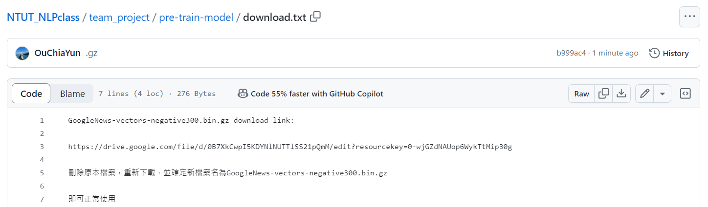

### team_project

## \*\*推薦 google 雲端(含資料集等完整連結)

https://drive.google.com/file/d/16ylB0HnQUWVs7amd4aIG1H-h-SK9gzmp/view?usp=sharing

包含所有資料，可直接使用

## github (git lfs 已超出限額，無法使用)

[git@github.com:OuChiaYun/NTUT_NLPclass.git](https://github.com/OuChiaYun/NTUT_NLPclass/tree/main)

期末專案位於 team_project 資料夾

需手動下載 pre-train-model 內容，置於 pre-train-model 底下




## 本地端網頁(搜尋應用)

推薦搜尋 :

```
a 2014 mystery thriller directed by David Fincher and starring Ben Affleck, captivates audiences with its plot twists.
```

下載後，cd 至 flask, 執行/try.py

因 pre_train 模型較大，等待一段時間後即可使用本地端網頁操作

---

如果出現以下錯誤，代表 pre-train-model 資料錯誤


請將 pre-train-model 內的資料清空，並且從

https://drive.google.com/file/d/0B7XkCwpI5KDYNlNUTTlSS21pQmM/edit?resourcekey=0-wjGZdNAUop6WykTtMip30g

下載該資料

---

## ppt on canvas :

https://www.canva.com/design/DAGITehtzEU/FKiPmMqWZM4dPdI6cJJ5tw/view?utm_content=DAGITehtzEU&utm_campaign=designshare&utm_medium=link&utm_source=editor
